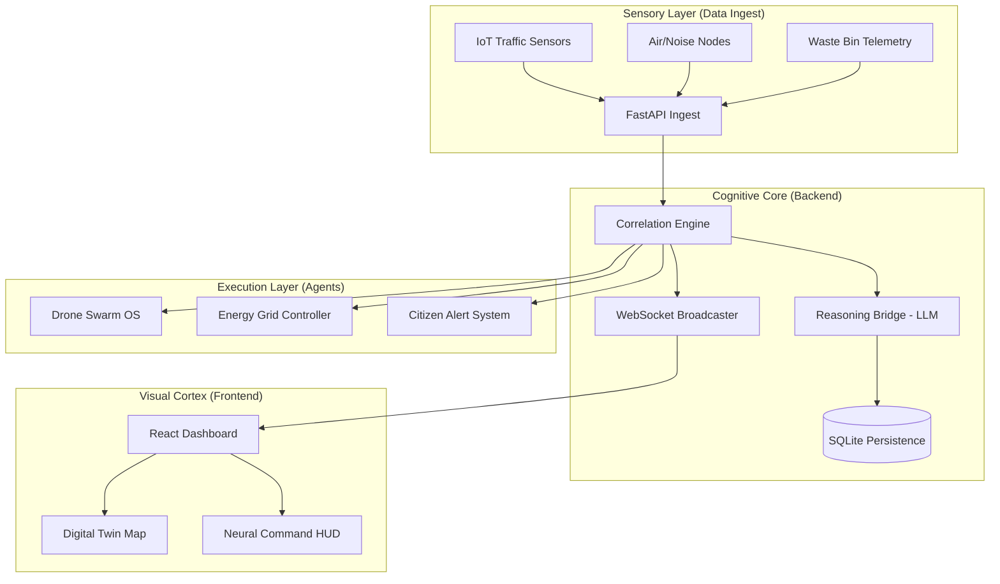

# 🌐 ACIS v2: Autonomous Civic Intelligence System
### *The Omniscient City: A Self-Governing Urban Organism*


---

## 📖 Overview
Modern cities are fragmented ecosystems of siloed data. Traffic sensors don't talk to power grids, and emergency response teams often react to incidents minutes after they've peaked. 

**ACIS v2 (Autonomous Civic Intelligence System)** is a production-grade, modular "Urban OS" designed to unify these silos into a sentient infrastructure. It moves beyond simple monitoring into the realm of **Predictive Autonomy**, where the city anticipates crises, optimizes its own energy metabolism, and governs its resources through a federated, privacy-preserving intelligence network.

---

## 🚀 Key Features

### 🧠 Neural Command & Governance
*   **Module 1: Natural Language Command Interface**: Conversational AI for operator directives with integrated evidence citations.
*   **Module 8: AI Policy Playground**: Simulate the social, economic, and ethical impacts of urban legislation before enactment.
*   **Module 11: Sovereign Identity Shield**: Privacy-preserving security using Zero-Knowledge Proofs (ZKP) and decentralized identifiers (DID).

### 🛰️ Perception & Digital Twin
*   **Module 2: Predictive Shadow Mode**: Real-time 3D Digital Twin with a "T+15m" future shimmer to visualize forecasted urban states.
*   **Module 3: Tactical Drone Swarm**: Autonomous coordination of UAV fleets for aerial perception and rapid incident verification.
*   **Module 7: Bio-Sentinel Surveillance**: Pathogen risk heatmapping and wastewater health indexing for proactive pandemic response.

### 🏗️ Infrastructure & Metabolism
*   **Module 4: Sentient Infrastructure**: Condition-based maintenance monitoring with Remaining Useful Life (RUL) sequence modeling.
*   **Module 5: Energy Metabolism**: Joint optimization of the power grid with Vehicle-to-Grid (V2G) feeds and "Island Mode" resilience.
*   **Module 9: Climate Resilience**: Automated heat-island mitigation and flood pre-response synchronization.

---

## 🏗️ System Architecture



---

## 🛠️ Tech Stack

| Layer | Technologies |
| :--- | :--- |
| **Frontend** | React 18, Vite, TailwindCSS (Vanilla Custom), Framer Motion, Lucide Icons |
| **Mapping/GIS** | React-Leaflet, OpenStreetMap, H3-Indexing Simulations |
| **Backend** | FastAPI (Python 3.10+), Uvicorn, Asyncio |
| **Database** | SQLite3 (Persistent Telemetry Archive) |
| **Streaming** | Simulated Geo-Sharded Event Streams (Kafka-style) |
| **Visuals** | Glassmorphism, CSS3 Keyframes, Recharts |

---

## ⚙️ Setup & Installation

### Prerequisites
*   Python 3.10 or higher
*   Node.js 18 or higher (npm/yarn)

### 1. Backend Setup
```bash
# Navigate to server directory
cd server

# Install dependencies
pip install fastapi uvicorn pydantic

# Start the Intelligence Core
python main.py
```

### 2. Frontend Setup
```bash
# Navigate to dashboard directory
cd dashboard

# Install dependencies
npm install

# Launch the Operator Interface
npm run dev
```

---

## 🎮 Usage Guide

1.  **Initialize the Twin**: Open [http://localhost:5173](http://localhost:5173). You will see the live Digital Twin and urban metrics population.
2.  **Issue Commands**: Use the top command bar to ask for a "City Briefing" or "Status Report".
3.  **Toggle Layers**: Use the "Map Layers" menu to switch between Traffic, V2X, and Pathogen Heatmaps.
4.  **Activate Crisis Mode**: Use the top-right button to initiate emergency response protocols and see AI-optimized routing.
5.  **Simulate Policy**: Navigate to the AI Governance HUD and click "Draft Policy" to see the "What-If" engine in action.

---

## 📂 Project Structure
```text
acis-v2/
├── dashboard/              # React + Vite Frontend
│   ├── src/
│   │   ├── App.jsx         # Core Dashboard Logic & HUDs
│   │   ├── index.css       # Premium Design Tokens & Animations
│   │   └── main.jsx        # Entry Point
├── server/                 # FastAPI Backend
│   ├── main.py             # Logic, Reasoning, & Simulations
│   └── acis_history.db     # Telemetry Persistence
└── PHASES.md               # Detailed Technical Roadmap
```

---

## 📈 Current Status: Phase 6
The project has successfully reached **Phase 6: The Omniscient City**. All 11 tactical modules are operational. Future development will focus on real-world hardware integration and production Kafka sharding.

**Developed by Antigravity AI for Advanced Urban Autonomy.**
